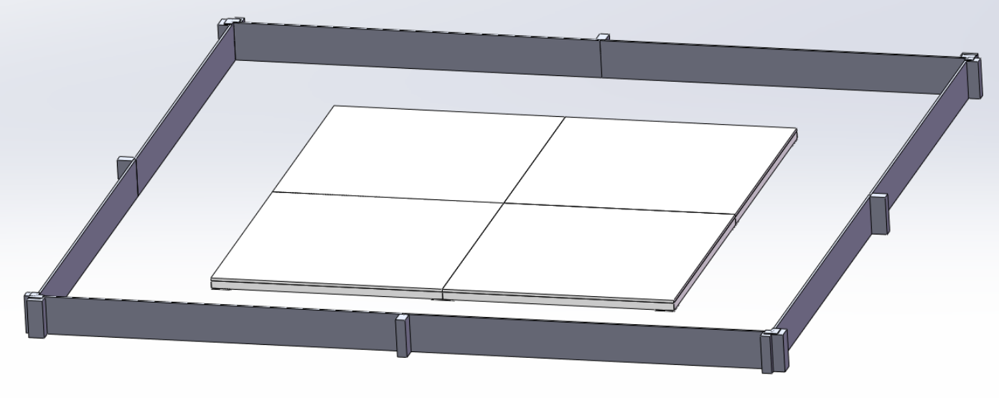
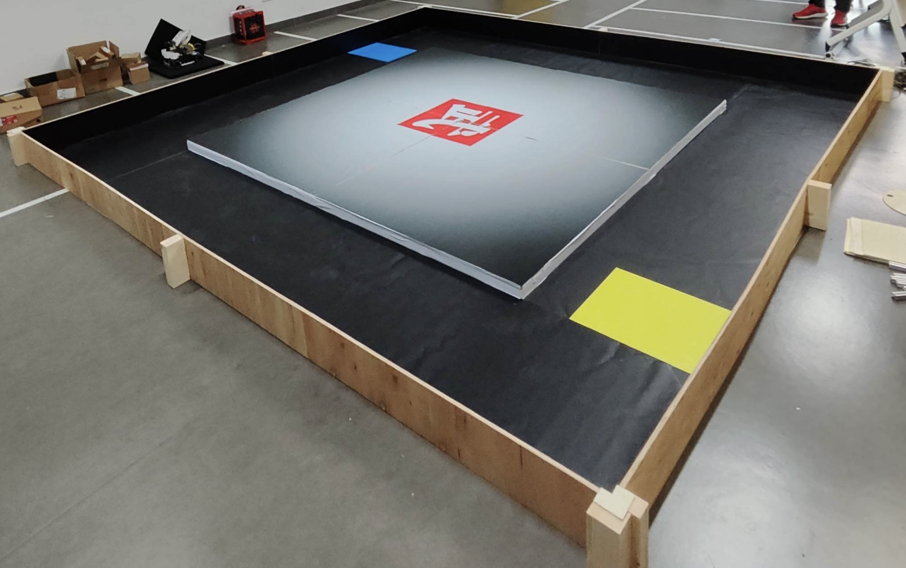
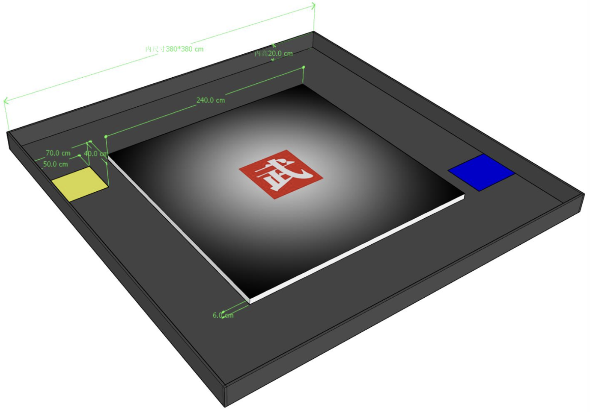

# 中国高校智能机器人创意大赛（主题三）低成本训练擂台

> 这是一个专为 **中国高校智能机器人创意大赛（主题三：轮式格斗）** 设计的低成本训练擂台。
> 适用于 **4kg 级** 格斗机器人调试与训练。

## 💡 项目简介

官方标准的比赛擂台造价昂贵且不易运输。本项目旨在提供一个**符合官方尺寸要求**、但造价较低（¥1200~2000）的木质替代方案。
整体采用木工结构打造，表面贴有 PVC 哑光贴纸以模拟比赛场地的摩擦力与视觉效果。

## 📥 模型下载 (Download)

由于 SolidWorks 工程文件体积较大，源文件托管在网盘中，GitHub 仅作为文档维护平台。

- **下载链接**：[百度网盘](https://pan.baidu.com/s/1T4pkdNaI4oGYY3aX2SX6jA)
- **提取码**：`2233`
- **文件包含**：
    - 完整装配体 (**SolidWorks 2023**)
    - 通用格式 (`.STEP`)
- **⚠️ 注意**：源文件使用 **SolidWorks 2023** 保存。

## 📏 规格参数 (Specifications)

符合大赛主题三的场地尺寸标准。

## 🛠️ 物料清单 (BOM)

**💰 预估总造价：¥1200 ~ ¥2000**
*(以下物料建议多方比价，选择淘宝/拼多多低价商家)*

### 1. 核心结构材料
| 部件 | 材料建议 | 用途 |
| :--- | :--- | :--- |
| **胶合板** | 多层实木板 | 用于台阶顶部、底部垫高板、围栏主体 |
| **木条** | 松木方/杂木方 | 用于台阶侧面支撑、中心龙骨、围栏辅助固定 |
| **贴纸** | **PVC 哑光贴纸** | 哑光材质可避免反光干扰传感器 |

### 2. 连接与耗材
* **固定方式**：木工钉子 + 木工胶辅助。
* **推荐胶水**：太棒胶 (Titebond) 或高强度白乳胶。

### 3. 辅助工具
* 锤子
* 砂纸 (用于打磨木刺，防止划伤)

> 📋 完整 Excel 版 BOM 表请在仓库的 `/bom` 目录下查看。

## ⚠️ 搭建与使用注意事项 (Critical Notes)

**由于追求低成本，本方案在结构上做了一些简化，使用时请务必注意以下几点：**

1.  **围栏固定问题**：
    * 本设计的四周围栏**没有与地面进行刚性连接**。
    * *建议*：实际使用时，请务必在围栏外侧堆放重物（如沙袋、哑铃片或大桶水）进行抵挡，防止机器人撞开围栏冲出。当然，有条件的也可选择加固围栏
2.  **台阶平整度**：
    * 中央台阶由四块独立模块拼接而成。由于木工制造误差，拼接处可能会有**些许高度差**。
    * *建议*：拼装时可在底部垫薄纸片找平，或用大力胶带封住接缝。
3.  **地面要求**：
    * 台阶四周的延伸贴纸是直接贴在地板上的。
    * *要求*：请务必在**平整、干净（无灰尘）的瓷砖或水泥地面**上铺设，否则贴纸容易起皱或脱落。

## 📜 开源协议

本项目采用 **CC BY-SA 4.0** 协议开源。
你可以自由修改和分发，但必须保留原作者署名，且修改后的作品必须以相同协议开源。

## 📬 交流与反馈

如果你对搭建有疑问，或者有更省钱的方案，欢迎交流！

- **B站**：[mcal](https://space.bilibili.com/693733860) 
- **邮箱**：1905360479@qq.com